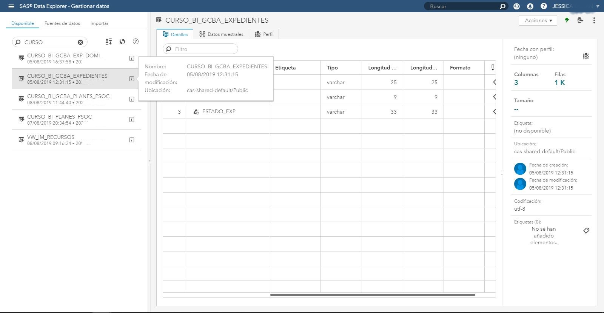
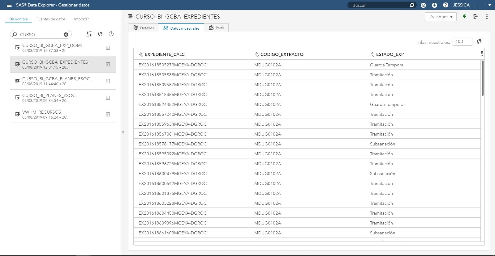
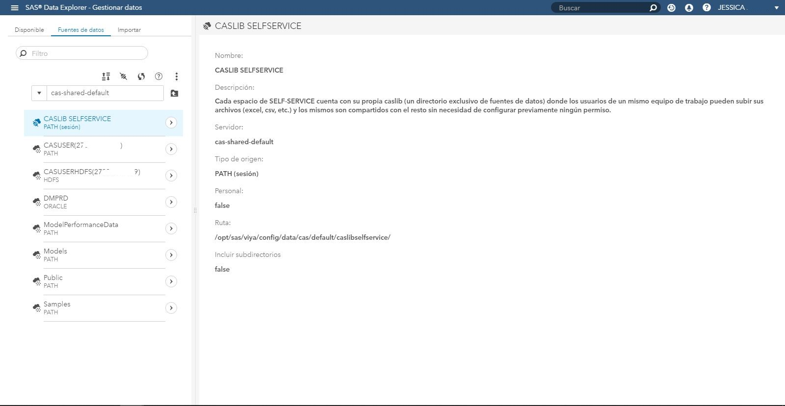
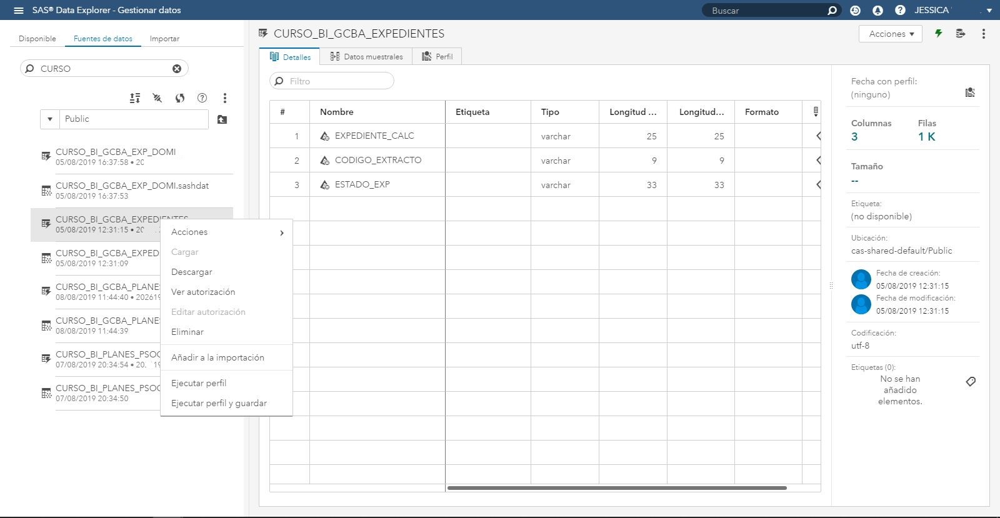

# Introducción a la plataforma

Luego de acceder a la plataforma, y habiendo realizado las configuraciones iniciales (sólo la primera vez que se accede), nos encontraremos inmediatamente con el aplicativo SAS DRIVE <https://sas-viya.buenosaires.gob.ar/SASDrive/>. Éste es, en esencia, un administrador de reportes y otros archivos como imágenes, que cuenta fundamentalmente con tres espacios o directorios a considerar.

En primer lugar, tenemos My Folder (Mi Carpeta), la cual es de uso personal y todo reporte o información que se aloje allí será exclusivamente de acceso y administración del usuario propietario. Se recomienda el uso de la misma para proyectos en los que no sea necesario compartir la información con el resto del equipo de trabajo u otros usuarios.

Para ello, es decir, si se quisiera compartir la información con el equipo de trabajo, se encuentra disponible, dentro del directorio /SELF-SERVICE (alojada en la carpeta raíz SAS Content), al menos un directorio -dependiendo de la cantidad de equipos en los que uno participe- que se denominará, usualmente, en función del nombre del organismo dentro del cual desempeña las tareas el equipo o bien un nombre que haga mención a la actividad o proyecto de dicho equipo de trabajo.

(\#fig:unnamed-chunk-1)SAS DRIVE - /SELF-SERVICE

Esta carpeta -que llamamos ESPACIO DE TRABAJO DEL EQUIPO o ESPACIO DE SELFSERVICE- es de suma importancia para los usuarios, ya que la misma y todo su contenido es administrado de manera independiente por sus miembros (los miembros administradores). Es decir, los integrantes del equipo, a los cuales se les haya otorgado los permisos de administración sobre el espacio de selfservice, podrán construir jerarquías de directorios, guardar reportes u otros archivos, así como también elinarlos o hacer todos los cambios que precisen. Cabe mencionar, que de la misma manera que existe el rol de usuario administrador, sobre el espacio de selfservice también pueden asignarse roles de usuarios que únicamente puedan consultar reportes. De allí entonces la necesidad de establecer una estructura de carpetas, aunque por supuesto, cada equipo de trabajo presentará necesidades y metodologías de trabajo diferentes que pueden o no precisar de la misma, pero es importante recalcarlo con el objetivo de entender que este espacio de selfservice es totalmente autoadministrable, transpearente y escalable por sus usuarios.

En último lugar, nos encontraremos con el directorio /SSSYP, que se corresponde con el lugar donde se alojan todos los reportes "productivos", es decir, aquellos que son desarrollados por el área de Business Intelligence y a los cuales los usuarios sólo podrán consultar (no modificar) bajo previa solicitud. Más adelante, contaremos un catálogo de reportes productivos a disposición en la raíz del directorio SSSYP (consultar).

Teniendo en cuenta los tres anteriores "espacios de trabajo" mencionados, cabe destacar que si uno o más reportes son utilizados con frecuencia pueden disponibilizarse en la sección de "Acceso rápido" o en "Mis Favoritos", de manera similar a cómo trabajan otros administradores de archivos.

(\#fig:unnamed-chunk-2)SAS DRIVE - Sección de Acceso Rápido

Otra posibilidad para acceder a estos reportes de acceso frecuente es visualizarlos de manera directa a través del aplicativo SAS REPORT VIEWER <https://sas-viya.buenosaires.gob.ar/SASReportViewer/>, donde se disponibiliza el historial de uso.

(\#fig:unnamed-chunk-3)SAS REPORT VIEWER

Al mismo se puede acceder, por supuesto, a través de la url señalada anteriormente, pero también puede hacerse uso del panel lateral izquierdo, donde además de esta herramienta se encuentran otras que veremos más adelante. 

(\#fig:unnamed-chunk-4)Menú lateral de Aplicativos SAS

El nombre que recibe en dicho panel es "Ver Informes" y, como su nombre bien lo indica, el único objetivo de este aplicativo es justamente tener de manera rápida la posibilidad de acceder a los reportes, no sólo al historial -que mencionamos arriba- sino también al resto, que pueden encontrarse en los diferentes directorios disponibles (/SELF-SERVICE, /SSSSYP o My Folder). Para acceder a ellos, basta con hacer uso de la opción "Explorar Informes" que se encuentra en la parte superior derecha de la pantalla. 

(\#fig:unnamed-chunk-5)SAS REPORT VIEWER - Explorador de Informes

Haciendo click en dicha opción nos encontraremos con la estructura habitual, pero en formato compacto. Se puede navegar hasta el reporte que se precisa (o buscarlo en la barra superior de búsqueda) y hacer click sobre el botón "Abrir".También se pueden realizar otras opciones como renombrar, eliminar o mover, o añadir como acceso directo, siempre por supuesto en relación a los permisos que se tenga para dicho espacio de trabajo.

(\#fig:unnamed-chunk-6)SAS REPORT VIEWER - Gestión de Informes

Ahora bien, hemos estado hablando hasta aquí de gestión de reportes, pero imaginando que aún no tenemos acceso a ninguno y que no hemos creado nuestro primer reporte, es hora de llevar esta tarea adelante, para la cual necesitaremos de manera excluyente de alguna fuente de datos, esto es, algún archivo de datos (.xsls, .csv u otros) o tabla disponibilizada directamente desde la conexión al DataWarehouse (base de datos central del equipo de BI).
Para comenzar con este punto, deberemos acceder al aplicativo SAS Data Explorer <https://sas-viya.buenosaires.gob.ar/SASDataExplorer/>, denominado como "Gestionar Datos" en el panel menú lateral.
Ya en el Data Explorer, nos encontraremos con una pantalla dividida en dos secciones, de la cuales la primera (la de la izquiera) contará con tres pestañas o tabs. Estas son: "Disponibles", "Fuentes de Datos" e "Importar". Antes de comenzar, si ya tenemos conocimiento de que el área de BI ha dejado a nuestra disposición una tabla o tablón de datos, construido especialmente para nuestro análisis o exploración de datos, entonces recurriremos rápidamente a la sección de Disponibles, haciendo uso de la barra de búsqueda a través del nombre o porción del nombre de nuestra tabla.

(\#fig:unnamed-chunk-7)SAS DATA EXPLORER

Se destada que, posicionándose sobre la misma, pueden verse, a modo de vista previa, ya algunos datos referentes a nombres de columnas o incluso a una porción de los datos mismos. Esto nos permitirá saber, de manera anticipada, si la fuente de datos con la que queremos trabajar es adecuada o cuenta con la información correcta para nuestra análisis.

(\#fig:unnamed-chunk-8)SAS DATA EXPLORER - Información de una tabla

(\#fig:unnamed-chunk-9)SAS DATA EXPLORER - Muestra de datos

En caso de no contar con ello, entendiendo que haremos un primer uso de la plataforma con datos propios, entonces accederemos a la sección de Importar. Allí hay diferentes opciones, de la cuales mencionaremos fundamentalmente dos. La primera implica cargar un archivo que se encuentra en nuestro equipo local (nuestra computadora) y la segunda, cargar la información desde una "Google Sheet". Esta última se realiza a través de la opción de "Redes Sociales".

(\#fig:unnamed-chunk-10)SAS DATA EXPLORER - Carga de Archivo Local

(\#fig:unnamed-chunk-11)SAS DATA EXPLORER - Acceso a Google Drive

Tanto en una opción como en otra, llegaremos al mismo punto: deberemos decidir dónde alojar la información que estamos subiendo a SAS, y para ello tenemos que volver a recurrir a una estructura similar a la vista para la gestión de reportes pero en este caso exclusiva de tablas -fuentes de datos-. ¿Cómo sería esto?. Para entenderlo mejor, nos dirigiremos a la sección Fuentes de Datos. En el primer nivel, nos toparemos con la opción de elegir entre "cas-shared-CASdesa" o "cas-shared-default", cada uno de ellos responde con la consigna de elegir entre un servidor de desarrollo o productivo. Los usuarios de selfservice siempre trabajarán en productivo, por lo cual, la opción a elegir es siempre "cas-shared-default".

(\#fig:unnamed-chunk-12)SAS DATA EXPLORER - Elección del Servidor

Ingresando a aquel, aquí sí nos encontraremos con la estructura que mencionábamos anterioremente. Es decir, contamos un espacio de uso personal, uno de uso para el equipo y uno "productivo". A los própositos de esta introducción, haremos única mención del espacio de trabajo del equipo de selfservice, que será una "CASLIB SELFSERVICE",término que responde a la nomenclatura utilizada por la plataforma. Ésta es básicamente un directorio sobre el cual sólo se pueden almacenar archivos que sean fuentes de datos (excel, csv, información de google sheets, etc.). La imagen también brinda una breve descripción de la misma, dado que consideramos de suma importancia su entendiemiento y uso. Toda información que se halle allí tendrá la posibilidad de ser consultado por cualquier miembro del equipo, sin necesidad de previamente configurar permisos de acceso (como sí lo es el caso de la información que provenga de la conexión al DataWarehouse)

(\#fig:unnamed-chunk-13)SAS DATA EXPLORER - CASLIB SELFSERVICE

Ahora sí, teniendo a mano lo anterioremente explicado, es que podemos subir la info que elijamos, tanto desde nuestra computadora como desde un google sheets, siempre teniendo en cuenta que la misma debe preferentemente guardarse en esta "caslib".

Finalmente, con la fuente de datos a disposición, podremos de una vez comenzar con la elaboración de nuestro reporte, haciendo click derecho sobre la misma y elegiendo dentro de las acciones la opción de "Explorar y Visualizar Datos".

(\#fig:unnamed-chunk-14)SAS DATA EXPLORER - Acciones sobre una fuente de datos

Terminado así, si han prestado atención, habrán visto a lo largo de esta introducción, con ayuda de las imágenes, que la posibilidad de crear un reporte se presenta tanto desde la interfaz del aplicativo SAS DRIVE como también en SAS REPORT VIEWER, y esto es así, ciertamente. No hay una sóla manera de comenzar la contrucción de nuestra análisis y el camino aquí presentado es sólo uno de esas maneras, quizás la más recomendable, dada la necesidad de entender y disponibilizar en primera medida de nuestra fuentes de datos para poder trabajar. Pero, una vez que ustedes como usuarios se familiaricen con el uso de la plataforma, sepan que es posible tomar cualquier camino para ir de los datos a las decisiones.
