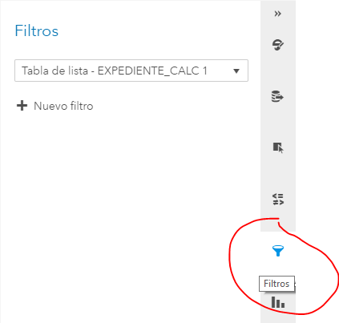
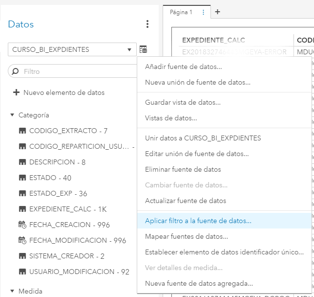
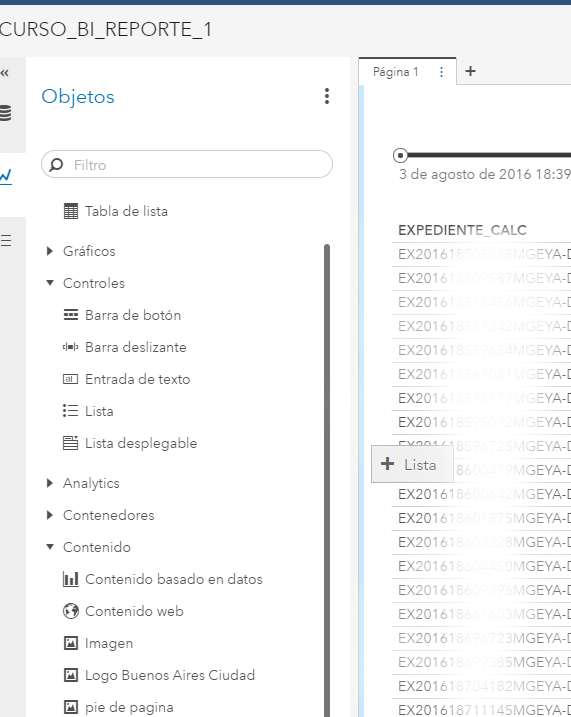

# Práctica Reportes 1

Ahora usando la tabla resultante del capítulo anterior, vamos a diseñar nuestro primer reporte.
El objetivo de este capítulo es aprender a realizar un reporte sencillo, para visualizar los datos de la tabla y agregar filtros, tanto fijos como dinámicos. 

## Objeto "Tabla de lista"

* En el panel de objetos a nuestra izquiera, vamos a seleccionar Tablas --> Tabla de lista y arrastramos hacia el area de trabajo de la Página 1.

(\#fig:unnamed-chunk-1)Tabla de lista

* Tenemos dos formas de agregar columnas en la tabla: 
  1. Desde el panel general de datos, seleccionando los elementos y arrastrándolos hasta posicionarlos sobre la tabla,
  2. Teniendo seleccionada la tabla, desde el panel "Roles de datos", eligiendo la opción "Columnas", "Añadir"

Nótese que hay un <b>asterisco rojo</b> que acompaña la sección "Columnas" eso indica que es obligatorio agregar al menos una columna para que el objeto, en este caso la tabla, se pueda construir.
  

* Seleccionamos las columnas que deseamos visualizar en la tabla y hacemos click en "Aceptar"

(\#fig:unnamed-chunk-3)Añadir columnas

Si todo salió bien, deberíamos poder visualizar ahora la tabla con los datos que elegimos. 
Es importante aclarar que el objeto "tabla de lista" tiene un límite de registros que se pueden visualizar, en general ese límite es de 40.000 filas. 

## Filtros fijos sobre el objeto

Todos los objetos aceptan este tipo de filtros.

Supongamos que queremos visualizar todos los expedientes cuyo "ESTADO_EXP" -estado actualizado del expediente- sea distinto a "Guarda Temporal":

* Siempre manteniendo el objeto seleccionado, en este caso nuestra tabla, seleccionamos la sección "filtros" del panel de la derecha:

(\#fig:unnamed-chunk-4)Filtros sobre objeto

* Hacemos click en "Nuevo filtro"
* Seleccionamos el elemento de datos sobre el que queremos aplicar el filtro, en nuestro caso "ESTADO_EXP".
* Destildamos los valores a descartar, "Guarda Temporal" y cualquier otro estado que queramos descartar.

## Filtros sobre la fuente de datos

Si queremos aplicar un filtro que afecte a todo el reporte, conviene utilizar esta opción.
Por ejemplo si quisieramos descartar en todo el reporte los expedientes en "ARCHIVO TEMPORAL".

* Vamos al panel de datos de la izquierda y seleccionamos la opción "Aplicar filtro a la fuente de datos..."

(\#fig:unnamed-chunk-5)Filtros sobre fuentes de datos

* Llegamos a una pantalla un poco más avanzada para la construcción de filtros.
* Buscamos el elemento de datos sobre el que vamos a aplicar el filtro, en nuestro caso nuevamente "ESTADO_EXP"
* Arrastramos el elemento hacia el panel y lo soltamos en el cuadro "condición"
* Ahora subimos y elegimos la solapa de "Operadores"
* Elegimos dentro del grupo "Comparación" el operador distinto "<>"
* En "cadena" escribimos el valor que queremos descartar, por ejemplo "ARCHIVO TEMPORAL"
* Por último hacemos click en "ACEPTAR"

Si todo funcionó como esperábamos la tabla no nos debería estar mostrando los registros correspondientes a expedientes en ESTADO_EXP = "ARCHIVO TEMPORAL"

## Filtros dinámicos

Ahora vamos a sumar al reporte algunos controles simples para interactuar con la tabla en forma de filtros.
El filtro más comun que existe en todo tablero o reporte es el filtro de fechas y si no lo encontramos como filtro, seguramente tendremos algún gráfico que muestre una evolución temporal de alguna métrica.

### Barra deslizante o slider

Supongamos en nuestro caso que queremos agregar un filtro dinámico utilizando la fecha de creación (fecha de caratulación del expediente):
* Vamos al panel de objetos y buscamos dentro del grupo "Controles" la "Barra deslizante". Este control es muy útil para usar en fechas.
* Arrastramos el objeto al area de trabajo intentando que nos quede arriba de la tabla.
* En el panel de roles de datos, seleccionamos "FECHA DE CREACIÓN"
* Por último, para que el control actúe como filtro sobre la tabla, manteniendo seleccionado el objeto, vamos a la sección "Acciones" del panel de la derecha.
* Elegimos la tabla de lista, dentro de "Enlaces de objeto"

(\#fig:unnamed-chunk-6)Barra deslizante

Ahora, si modificamos los valores de la barra deslizante, la tabla se debería actualizar, filtrando los datos en base al rango de fechas establecido.

### Lista o lista desplegale

Supongamos ahora que queremos incluir un filtro para seleccionar una o varias tratas.
Para ello podemos usar los controles "lista" o "lista desplegable". El primero nos permitirá elegir varios valores, la lista desplegable en cambio, sólo uno.

* Nuevamente nos dirigimos al panel de objetos, y dentro del grupo de "Controles" seleccionamos y arrastramos hacia el reporte, el control deseado, en nuestro caso elegimos "Lista", ya que queremos poder seleccionar varias tratas.

* Tratamos de ubicar el objeto a la izquierda de nuestra tabla:

(\#fig:unnamed-chunk-7)Listas

* En el panel de roles de datos, seleccionamos "CODIGO_EXTRACTO"

* Luego, no debemos olvidar generar "la interacción" desde la sección "Acciones" del panel de la derecha al igual que el filtro anterior.

Ahora, si elegimos alguna trata, deberíamos ver como se actualiza la tabla.

## Ejercicio de ejemplo con comparación de datos

Si llegamos con el tiempo, podemos hacer un ejercicio para visualizar diferencias entre "ESTADO" y  "ESTADO_EXP"

## Acciones automáticas en todos los objetos

Lo veremos en otro capítulo

## Contenedores

Lo veremos en otro capítulo

