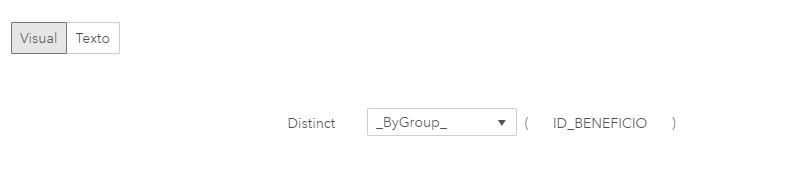
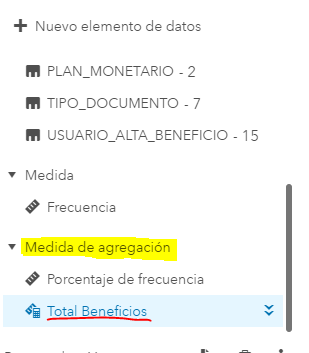

# Práctica Reportes 2

Ahora vamos a construir un segundo reporte con algnos gráficos, elementos calculados y controles de filtros básicos. Siempre tratando de priorizar los conocimientos más útiles pensando en reportes sencillos para visualizar y controlar datos.

Iniciamos un nuevo reporte y seleccionamos en este caso la tabla <b>CURSO_BI_GCBA_PLANES_PSOC</b> que tenemos disponible en la librería Public.
Cada registro de esta tabla representa un beneficio. Cada beneficio corresponde a una persona, esta persona es el beneficiario y en la tabla tenemos tipo y numero de documento como datos identificatorios del mismo.


```r
Nota importante: La tabla CURSO_BI_GCBA_PLANES_PSOC esta basada en el modelo de datos de PSOC pero no refrleja en ningun caso datos reales.
```

## Categorías vs. Medidas
Los elementos de datos de nuestras tablas son clasificados como categorías o medidas, como podemos ver en la lista de elementos de nuestra fuente de datos.

* Medidas: Una medida es todo aquello que tiene sentido sumar, promediar u operar con alguna función matemática o estadística. Estan asociadas a las métricas que podemos obtener o indicadores a calcular. Sirven para responder las preguntas referidas a cantidades o importes. Por ejemplo: las ventas totales, los costos, los pagos. En nuestro ámbito, el monto asociado a los pagos, la cantidad de integrantes en un hogar, el tiempo de demora en la resolución de un trámite.

* Categorías: Estos datos estan asociados a las dimensiones, entidades o características que nos permiten identificar con quién, cuándo o dónde se genera una operación o transacción. Por ejemplo el número de documento, el código de trata, una repartición o usuario.

## Configuración inicial de los elementos de datos
Al añadir una fuenta de datos al reporte, SAS interpreta de forma predeterminada todos los datos numéricos como medidas.

Por el comportamiento predeterminado, SAS nos tomará también como medidas la edad de una persona, el ID interno de una tabla (ID_EXPEDIENTE, ID_BENEFICIO), el año caratulación, etc. 
Por lo tanto una vez añadida la fuenta de datos al reporte, debemos seleccionar las categorías que fueron interpretadas como medidas y, elemento por elemmento, convertirlos a categoria:

<div class="figure" style="text-align: center">

<p class="caption">(\#fig:unnamed-chunk-2)Medida2Categoria</p>
</div>

Una vez hecho esto para el ID_BENEFICIO y el NUMERO_DOCUMENTO sólamente nos quedará una única medida en la lista de elementos de datos, la frecuencia.
La frecuencia es una medida que tendremos siempre disponible y nos servirá para contabilizar los registros de nuestro set de datos.

En este caso, la frecuencia total de la tabla debería coincidir entonces con la cantidad de valores distintos de ID_BENEFICIO, dado que como comentamos anteriormente cada registro de la tabla representaba un beneficio.

Para verificar lo anterior podemos construir nuestra propia medida para contabilizar beneficios.


## Elementos calculados

### Uso de DISTINCT 

En la pantalla de edición del nuevo elemento calculado:

1. Seleccionamos la sección "Operadores".
2. Seleccionamos el apartado "Agregado (simple)".
3. Elegimos "DISTINCT" y arrastramos hacia el área de construcción del elemento calculado:

<div class="figure" style="text-align: center">

<p class="caption">(\#fig:unnamed-chunk-3)DISTINCT</p>
</div>

Luego hacemos click en la sección "Elementos de Datos", seleccionamos el "ID_BENEFICIO" y lo llevamos como argumento a la función "DISTINCT".
El elemento calculado debe quedar como en la siguiente imagen:

<div class="figure" style="text-align: center">

<p class="caption">(\#fig:unnamed-chunk-4)DISTINCT</p>
</div>

Una vez guardado, si vamos a la lista de elementos de datos, veremos que se agregó en la lista de elementos de datos, la medida "Total Beneficios", como medida de agregación:

<div class="figure" style="text-align: center">

<p class="caption">(\#fig:unnamed-chunk-5)Medida de agregación</p>
</div>


Si quisieramos ahora tener un elemento calculado para contabilizar beneficiarios, deberíamos hacer lo mismo, pero en este caso usando el ID de cada persona, en este caso como no tenemos un ID de persona o beneficiario, debemos utilizar el número de documento.
Para ser precisos deberíamos considerar como ID el tipo y numero de documento, lo cual nos invita a utilizar otra función básica que será de utilidad para crear elementos calculados basados en la concatenación de dos o más columnas.


### Concatenar cadenas de caracteres

1. Nuevo elemento calculado
2. Seleccionamos "Operadores"
3. Elegimos la función "Concatenate" del grupo de funciones de "Texto (simple)"
4. Esta función acepta dos argumentos, que son las cadenas de caracteres a concatenar.

<div class="figure" style="text-align: center">

<p class="caption">(\#fig:unnamed-chunk-6)DISTINCT</p>
</div>

5. En nuestro caso aunque podríamos concatenar directamente el tipo y número de documento, como preferimos un guión en el medio, vamos a usar dos funciones "Concatenate" anidades en el mismo elemento calculado:

<div class="figure" style="text-align: center">

<p class="caption">(\#fig:unnamed-chunk-7)DISTINCT</p>
</div>

Nótese que fue necesario usar una función de conversión que nos permita incluir el Nro. de Documento que es numérico.
La función "Format" la encontramos dentro del grupo  de funciones de "Texto (simple)"

El código generado para este elemento calculado es el siguiente. <i>En modo texto podemos copiar y pegar para construirlo</i>

```r
Concatenate(Concatenate('TIPO_DOCUMENTO'n, '-'), Format(
'NUMERO_DOCUMENTO'n[Raw], 'BEST10.'))
```


Por último así como construimos "Total Beneficios", podemos haciendo uso de "DISTINCT" construir un nuevo elemento calculado "Total Beneficiarios" aplicando la función "DISTINCT" sobre el elemento que creamos en el punto anterior "Tipo y Nro. de Documento"


## Gráfico "Valor Clave"

Ahora veremos los distintos totales usando el grafico "Valor Clave"

1. Vamos al panel de objetos y dentro del grupo "Gráficos" elegimos "Valor Clave", 
2. Arrastramos el objeto al area de edición
3. En roles de datos le asignamos como Medida, la Frecuencia.
4. En el panel de opciones, bajamos hasta la configuración específica del gráfico "Valor clave" y elegimos el estilo "Infografía"
5. Seguimos en el mismo panel de opciones y en la parte inferior, destildamos la opción "Usar valor abreviado".

<div class="figure" style="text-align: center">

<p class="caption">(\#fig:unnamed-chunk-9)DISTINCT</p>
</div>

<div class="figure" style="text-align: center">

<p class="caption">(\#fig:unnamed-chunk-10)DISTINCT</p>
</div>

Lo que vemos en este valor clave es la cantidad total de registros en la tabla.

Ahora vamos a las opciones del gráfico, haciendo click en los "3 puntitos" que se encuentran en la esquina superior derecha del gráfico.
Elegimos duplicar y cambiamos la medida, reemplazando la frecuencia por "Total Beneficios"

Como vemos, la cantidad de beneficios coincide con la cantidad de registros de la tabla.
Hacemos lo mismo y generemos otro gráfico de valor clave, tomando como medida en este caso el "Total Beneficiarios"

<div class="figure" style="text-align: center">

<p class="caption">(\#fig:unnamed-chunk-11)DISTINCT</p>
</div>


## Gráfico de Torta

Haciendo click en el "+" a la derecha del título de la pagina "Pagina 1", creamos una nueva página.

1. En el panel de objetos, en la sección de gráficos, seleccionamos "Diagrama de tarta"
2. Arrastramos al area de trabajo
3. En el panel de "Roles de datos" elegimos la categoría "Plan"
4. Vemos que por default nos toma como medida la frecuencia, la cambiamos por "Total Beneficios"
5. Duplicamos el gráfico y seleccionamos como medida, "Total Beneficiarios"

<div class="figure" style="text-align: center">

<p class="caption">(\#fig:unnamed-chunk-12)DISTINCT</p>
</div>

Borramos ahora el segundo gráfico.
"Momento de jugar con las opciones que nos propone el panel de estilos del gráfico, buscando la mejor forma de mostrar la torta."


## Gráfico de barras

1. En el panel de objetos, en la sección de gráficos, seleccionamos "Gráfico de barras"
2. Arrastramos al area de trabajo, al lado del otro gráfico
3. En el panel de "Roles de datos" elegimos la categoría "ESTADO_BENEFICIO"
4. Modificamos Frecuencia por "Total Beneficios"


## Controles de filtros

1. En el panel de objetos, en la sección Controles, seleccionamos "Lista"
2. Arrastramos al area de trabajo
3. Asignamos en roles la categoría "USUARIO_ALTA_BENEFICIO"
4. En el panel de objetos, en la sección Controles, seleccionamos "Barra deslizante"
5. Arrastranis al area de trabajo
6. En el panel de "Roles de datos" elegimos como medida/fecha, la "FECHA_ALTA_BENEFICIO_D"


## Acciones, hacer interactuar gráficos y filtros entre sí

1. En el panel de acciones, elegimos la opción "Acciones automáticas en todos los objetos"
2. Probamos los filtros y la interacción entre los gráficos

<div class="figure" style="text-align: center">

<p class="caption">(\#fig:unnamed-chunk-13)DISTINCT</p>
</div>


