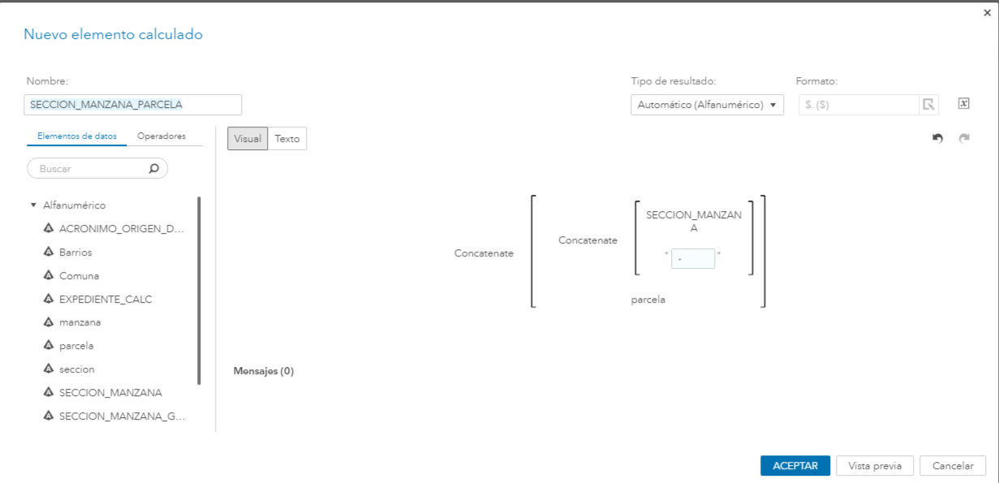
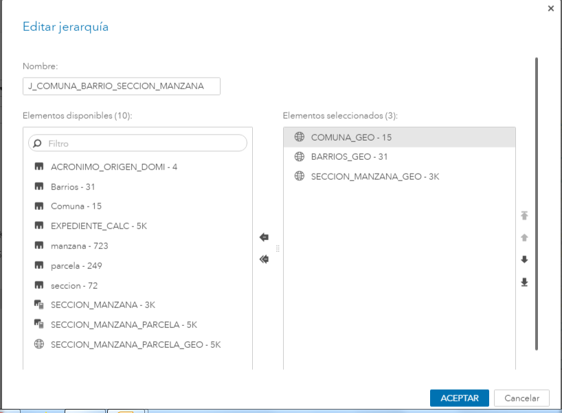
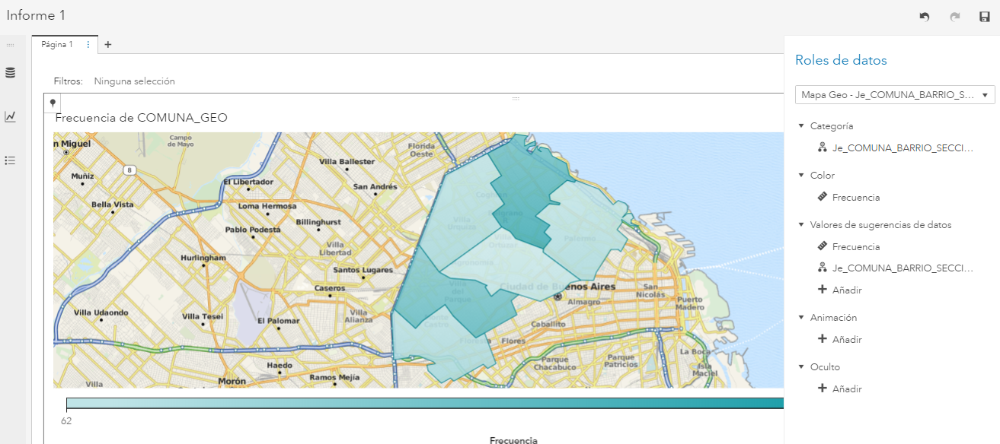
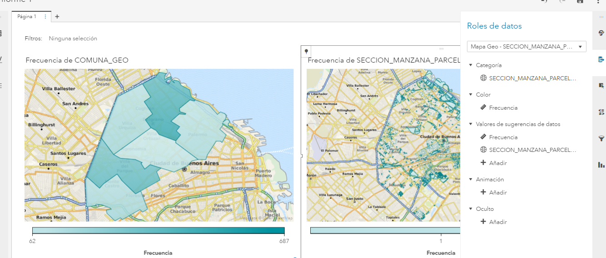
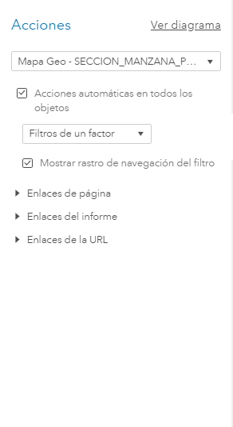
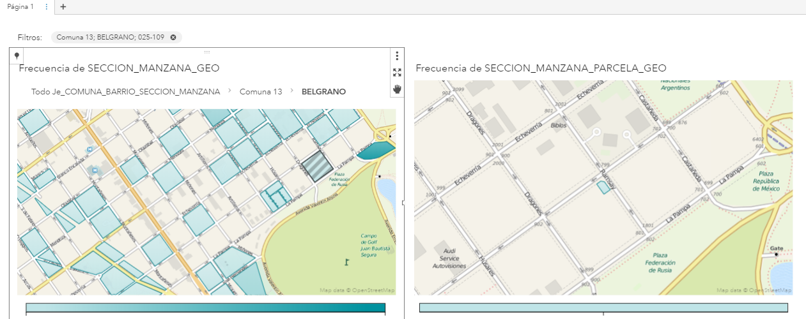

# Mapas


```r
Este capítulo esta en construcción, falta completar
```

El objetivo de este capítulo es explicar paso a paso como crear una visualización de datos sobre mapas geográficos.
Para esto haremos uso de tablas que ya estan precargadas en SAS Viya, y que reunen la información de los polígonos. 


```r
Explicar un poco el tema proveedores de polígonos y los datos que debemos tener en nuestro set de datos
```

1. Nuevo reporte, opción "Explorar y visualizar datos"

2. Agregamos la tabla CAS al reporte:
<div class="figure" style="text-align: center">

<p class="caption">(\#fig:unnamed-chunk-3)Añadir fuente de datos</p>
</div>

3. Generamos el elemento calculado "SECCION_MANZANA"
<div class="figure" style="text-align: center">

<p class="caption">(\#fig:unnamed-chunk-4)Sección-Manzana</p>
</div>

4. Generamos el elemento calculado -elemento greográfico- "SECCION_MANZANA"
<div class="figure" style="text-align: center">

<p class="caption">(\#fig:unnamed-chunk-5)Seción-Manzana-GEO</p>
</div>

5. Generamos el elemento calculado "SECCION_MANZANA_PARCELA"
<div class="figure" style="text-align: center">

<p class="caption">(\#fig:unnamed-chunk-6)Sección-Manzana-Parcela</p>
</div>

6. Generamos el elemento calculado, -elemento greográfico- "SECCION_MANZANA_PARCELA_GEO"
<div class="figure" style="text-align: center">

<p class="caption">(\#fig:unnamed-chunk-7)Sección-Manzana-Parcela-GEO</p>
</div>

7. Generamos la jerarquía 
<div class="figure" style="text-align: center">

<p class="caption">(\#fig:unnamed-chunk-8)Jerarquía GEO</p>
</div>

8. Seleccionamos el grafico "Mapa Geo"

9. Asociamos la jerarquía creada como rol de datos del mapas
<div class="figure" style="text-align: center">

<p class="caption">(\#fig:unnamed-chunk-9)Mapa 1 roles de datos</p>
</div>

10. Creamos otroa mapa y le asociamos el rol "ManzanaGEO"
<div class="figure" style="text-align: center">

<p class="caption">(\#fig:unnamed-chunk-10)Mapa 2 roles de datos</p>
</div>

11. Generamos la interacción automática entre todos los objetos
<div class="figure" style="text-align: center">

<p class="caption">(\#fig:unnamed-chunk-11)Acciones entre objetos</p>
</div>


